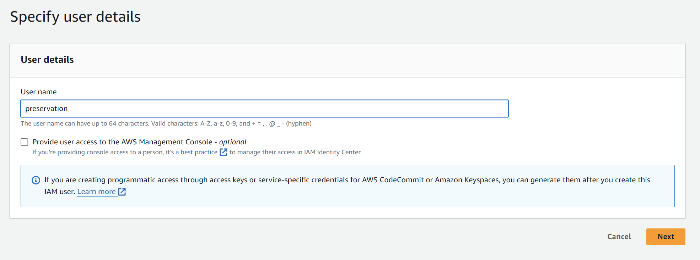
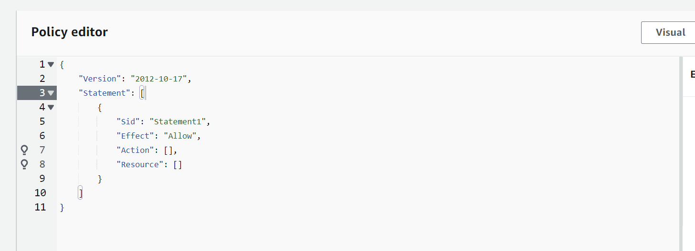
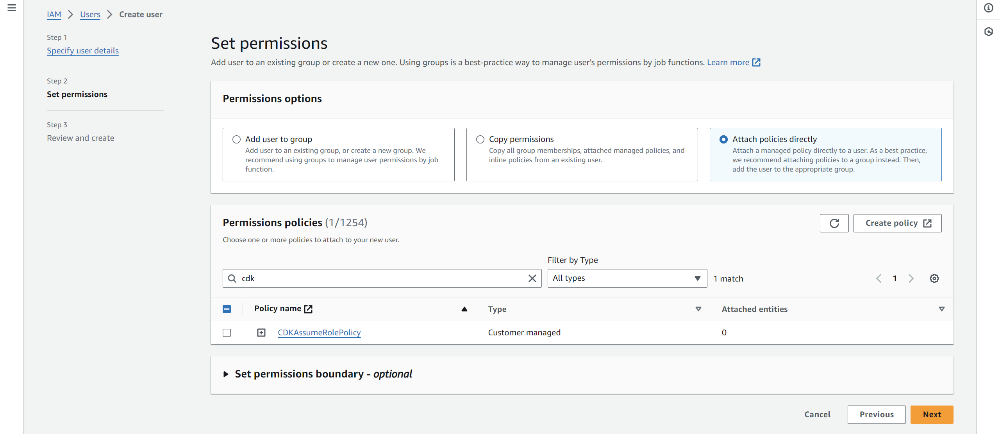
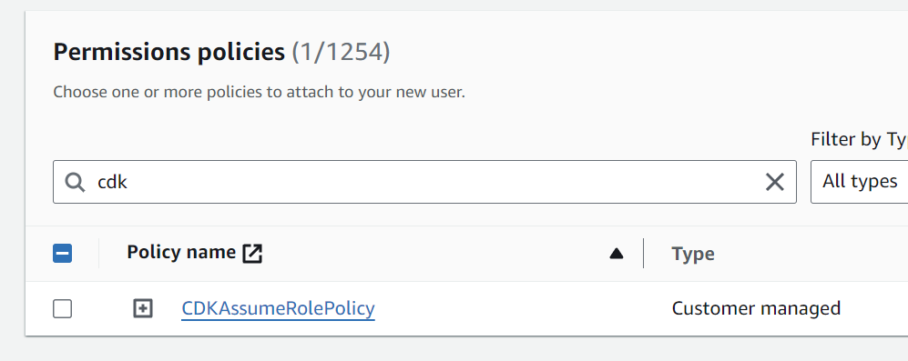
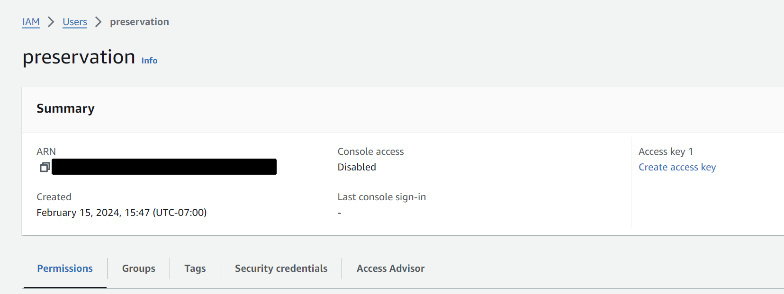
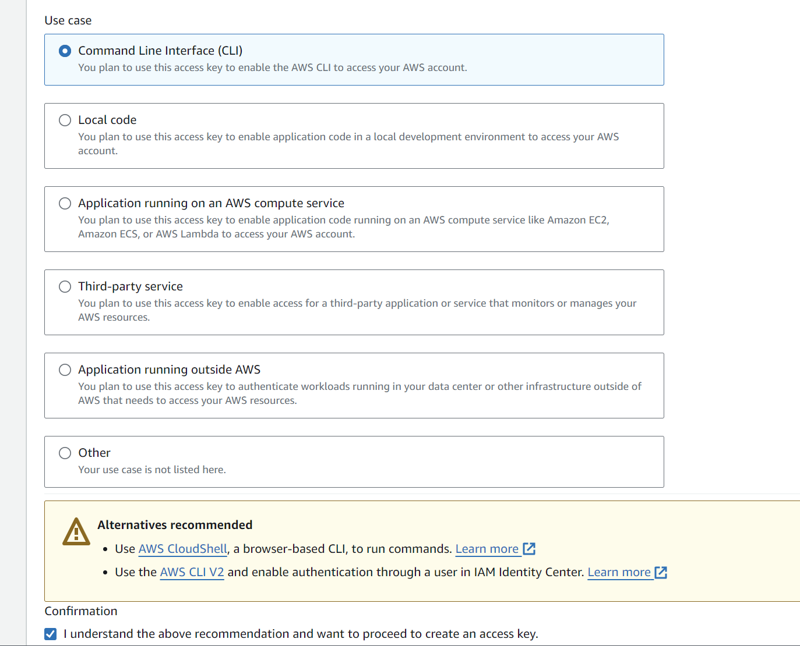

# **Requirements**
In order to complete the steps of this documentation, the following things are needed:
- npm
- node
- git
- aws cli
- docker

1. The following guide is useful for helping to install node and npm:  
https://docs.npmjs.com/downloading-and-installing-node-js-and-npm  
2. Git can be downloaded here:  
https://git-scm.com/downloads  
3. The following guide is helpful for downloading AWS Cli:
https://docs.aws.amazon.com/cli/latest/userguide/getting-started-install.html


Then, once you have npm, you will need to download aws-cdk and yarn globally. Run:
```bash
npm install -g yarn aws-cdk
```

# **Setup**
1. First clone the repository. To clone, run:
```bash
git clone https://github.com/2023-opportunity-hack/syntax-error--DigitalRecordsManagementforMuseumsandHistoricalSites
```
<br/>
<br/>

2. Now we will set up the local development environment. To do that, run:
```bash
yarn install
```
Followed by 
```bash
yarn release
```
This should build the files needed for local development.

## **Deploying Backend**
### Setting up AWS Account
1. Before anything can be completed, you will need to create an AWS account:
https://aws.amazon.com/free/
Here, it will ask for things like your name, email and your credit card details.

2. Once you are signed in, make sure you remember your account id. As this will be needed later. This can be found in the top right corner of the website.


3. Once you have access to the AWS Account, and implicitly to the AWS Console, you will need to create an IAM role for console access to your aws account. First, search for IAM in the search bar:


4. Click on this to get to the IAM page:


5. When you get to the IAM page, there will be a list of options on the left of the screen. Click on Users:


6. Now, click on Create Users


7. Now give the user a good name. In this case, the name is preservation:


8. Click Next
9. Now you should see this screen: 


10. Click on Attach policies directly:


11. Search for AdministratorAccess in the searchbar:


12. Tick this box:


13. Now we will have to create a custom policy. Click on create policy:


14. You will see this screen. Click on JSON:


15. You should see this screen:


16. In the policy editor, paste: 
```bash
{
    "Version": "2012-10-17",
    "Statement": [
        {
            "Effect": "Allow",
            "Action": [
                "sts:AssumeRole"
            ],
            "Resource": [
                "arn:aws:iam::*:role/cdk-*"
            ]
        }
    ]
}
```


  
17. Click Next:


18. Give your policy a good name, call it `CDKAssumeRolePolicy`


19. Now, back in the permissions page:


20. Search for CDKAssumeRolePolicy:


21. Click on the following check box:


22. Then, click Next:


23. And then, click Create user


24. You should be led to a page with a list of users. Look for your user in that list and click on it.:


25. You should see this page:


26. Click on Security Credentials


27. Keep scrolling until you see this:


28. Click on Create Access Key:


29. For use case, select Command Line Interface and then click the checkbox below to confirm:


30. Click Next  


31. Click Create Access Key  


32. You should now see this. Copy your Access keys and Secret Access Keys to somewhere safe. We will need it later.:  


33. Now we will have to configure your AWS profile in the terminal. Go to the root of the project directory and type the following. Replace `[YOUR PROFILE NAME]` with a descriptive name. Make sure you rememember this name as we will use it later.
```bash
aws configure --profile=[YOUR PROFILE NAME]
```

34. Now type in your Access Keys and Secret Keys when prompted.
Your default region name should be set to us-west-1.
Output format will be kept to None so just click enter.

## Deploying Backend
These commands should be run in `apps/devblocks-cdk`.
1. As such, navigate to that directory. From the root of the directory in the terminal, run:
```bash
cd apps/devblocks-cdk
```

2. From here, run the following command. Make sure to replace [AWS ACCOUNT ID] and [YOUR PROFILE NAME] with your actual account id and profile name respectively:
```bash
cdk deploy --all -c stage="dev" -c region="us-west-1" -c account="[AWS ACCOUNT ID]" --profile=[YOUR PROFILE NAME] -O ../devblocks-web/exports/cdk-exports-dev.json 
```
Write y and click enter for all the prompts that show up

This should take around 10-20 minutes as CDK deploys the resources to the cloud. So feel free to go grab a cup of coffee or something while this is happening. ☕

3. After the CDK has deployed the stack in your AWS account, go to the "Cloudformation" in your AWS console. Click on the "Opportunity-Hack-document-search" stack and then click on the resources tab. Click on the search bar to find the "SearchDocument" lambda function, you can identify the function by seeing the type of the resource in the table and clicking on the link adjacent to it, which will take you to the lambda function. In the lambda console click con monitoring and then click on the "Cloud Watch Logs" button, which will take you to the Cloudwatch log group. Copy the name of the cloud watch log group and save it somewhere on your device. Now, go back to the cloud formation in the AWS console, search for the "get logs" lambda function, and go to the lambda console for that function. In the lambda function, you will see the option, "Configuration" Click on it and then click on "Environmental variable" and add the value of the copied log group name to the variable, and save it.

## Deploying Frontend
Once the backend is deployed, we will now deploy the frontend.
1. We will have to run things from the directory `apps/devblocks-web`. As such, create a new terminal. And from the root of the project directory, run:
```bash
  cd apps/devblocks-web
```

2. From here, run:
```bash
yarn build
```

3. Once this is complete, navigate to `apps/devblocks-cdk` again. You can do that by running 
```bash
cd ../devblocks-cdk
```
4. Then, run the following. Again, make sure to replace  [AWS ACCOUNT ID]  and [PROFILE NAME] with your actual account id and profile name respectively:
```bash
cdk deploy --all -c stage="dev" -c region="us-west-1" -c account="[AWS ACCOUNT ID]" --profile=[PROFILE NAME]
```

5. Once the resources are deployed, you would be able to find the link to the website in the command line.
It should be in the format `[RANDOM SEQUENCE OF TEXT].cloudfront.net`
